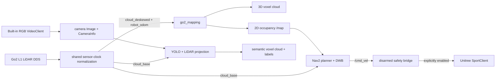

# Go2 EDU 3D SLAM, route navigation, and semantic mapping

For the safe two-terminal startup and arming sequence, see
[HOW_TO_RUN.md](HOW_TO_RUN.md).

This ROS 2 Foxy workspace is built for the Unitree Go2 EDU onboard Jetson and
its built-in L1 LiDAR and front RGB camera, with an optional Intel RealSense
D435i backend. It provides:

- bounded, persistent 3D voxel mapping from the firmware-deskewed L1 cloud;
- selectable direct D435i RGB-D voxel mapping without the ROS RealSense driver;
- live 2D occupancy projection with ray clearing for Nav2;
- conservative goal and named-route navigation;
- saved-map AMCL localization for repeat routes;
- a real 3D semantic voxel cloud made by projecting camera detections onto the
  synchronized base-frame L1 cloud;
- explicit map/semantic export to PLY, PGM/YAML, NPZ, and JSON; and
- a disarmed-by-default Unitree Sport command bridge with timeouts, slew limits,
  odometry freshness checks, and a LiDAR front-sector stop.

The implementation is clean-room code informed by the requested
[Go2-Inspector](https://github.com/amberhandal/Go2-Inspector/tree/281cccaecf8aeffa5476cd7b70c34f8ad984f8f4)
and
[autonomy_stack_go2](https://github.com/jizhang-cmu/autonomy_stack_go2/tree/43d5f54b389b251713f0097893c30fa76c870d54)
references. Their camera/semantic assumptions and mixed ROS versions are not
copied; see [THIRD_PARTY.md](THIRD_PARTY.md).

## Architecture



Unitree's firmware L1 odometry pipeline produces `/utlidar/cloud_deskewed` in
`odom` at roughly 15 Hz and `/utlidar/robot_odom` at roughly 150 Hz. Its clock
is about 502 seconds behind the Jetson clock on this device. One bridge derives
a shared offset and republishes `/go2/lidar/cloud_deskewed`, `/go2/odom`, and
the base cloud in the Jetson ROS clock while preserving sensor-relative timing.
Measured data on this firmware is already REP-103 (X forward, Y left, Z up), so
the bridge preserves cloud, pose, twist, and covariance coordinates by default.
The former native-axis rotation remains an opt-in parameter for verified legacy
firmware only. All project consumers use the normalized topics. The mapper accumulates the
firmware-registered output without running a second heavy SLAM process on the
Jetson. Topics remain parameters, so a loop-closing backend can instead feed
verified registered-cloud and odometry inputs.

## Device baseline

The workspace targets the inspected device baseline:

- Ubuntu 20.04, ARM64, Jetson Orin NX 16 GB;
- ROS 2 Foxy with CycloneDDS;
- robot-facing interface `eth0` (`192.168.123.99/24` on this unit);
- live Go2 topics `/utlidar/cloud`, `/utlidar/cloud_base`,
  `/utlidar/cloud_deskewed`, and `/utlidar/robot_odom`; and
- Unitree SDK2 Python plus its no-shared-memory CycloneDDS build.

The default LiDAR backend needs no additional sensor. The optional depth-camera
backend uses the installed USB Intel RealSense D435i.

## Build

If this directory was created by root, correct it once:

```bash
sudo chown -R "$(id -un):$(id -gn)" /home/unitree/SLAM_nav
```

Then, as that same non-root login account:

```bash
cd /home/unitree/SLAM_nav
source scripts/env.sh
python3 scripts/doctor.py
./scripts/build.sh
source scripts/env.sh
```

`scripts/env.sh` selects Foxy, the robot's CycloneDDS overlay, `eth0`, and the
installed no-SHM Unitree SDK runtime. This ordering is required on this device;
the system `/usr/local` DDS library can crash Python SDK RPC writers.

### Project-local Conda environment for YOLO and D435i

The core ROS 2 nodes intentionally remain on Foxy's `/usr/bin/python3`. Create
and activate the Python 3.8 Conda environment for the semantic YOLO node and
direct D435i capture with:

```bash
cd /home/unitree/SLAM_nav
./scripts/create_conda_env.sh
conda activate slam_nav
python3 scripts/doctor.py
```

Open a new terminal after the first creation so Bash loads Conda. For the
current terminal, run `source ~/.bashrc` before `conda activate slam_nav`.
The activation hook loads the ROS, CycloneDDS, Unitree SDK, and project overlay
automatically. `source scripts/activate_conda.sh` remains an equivalent helper.

This installs ARM64 Miniforge under `.miniforge3`, creates the environment at
`.conda/envs/slam_nav`, and mirrors the device's already validated Jetson CUDA
Torch/Ultralytics packages. It does not install a generic Torch build. Sourcing
`activate_conda.sh` also sources the ROS/device environment and sets
`GO2_SEMANTIC_PYTHON`. Once the environment exists, the regular `env.sh` and
mapping startup scripts also select it automatically for the semantic and
depth-camera nodes. The environment pins `pyrealsense2==2.55.1.6486`; this
avoids the device's obsolete ROS1 RealSense driver.

Do not reuse maps, routes, or camera extrinsics produced before the firmware
coordinate audit: the former bridge configuration inverted Y/Z and placed the
floor above the robot. Current `/go2` outputs preserve the firmware's verified
REP-103 coordinates.

## Calibrate before semantic fusion

The camera stream is verified at 1920×1080, but this device contains no usable
factory camera intrinsics or camera-to-L1 extrinsics. Follow
[docs/CALIBRATION.md](docs/CALIBRATION.md), update the two package YAML files,
inspect the projected-point debug overlay, and only then mark the semantic
calibration confirmed. Unknown 3D geometry is available before calibration;
camera detections and colors are deliberately withheld until the calibration
gate passes. Until intrinsics are installed, the topic named
`/go2/camera/image_rect` is an unrectified passthrough used only to keep the
geometry-only pipeline observable.

## Map and navigate in one session

Start the complete stack:

```bash
./scripts/start_mapping.sh
```

Run only one complete stack at a time. `start_mapping.sh` now refuses to start
when another `/go2/time_sync/status` publisher or project stack lock exists.
If `sensor time bridge process changed` is reported, stop every complete stack,
wait for the publisher to disappear, and start exactly one fresh stack. The
fault is intentionally restart-latched and cannot be cleared by re-enabling
motion inside the affected process.

This starts the camera bridge, mapper, semantic mapper, Nav2, and RViz. RViz
requires a graphical desktop; for a headless or plain SSH terminal, start the
stack without it:

```bash
./scripts/start_mapping.sh use_rviz:=false
```

The LiDAR mapper remains the default. Select exactly one geometric map backend:

```bash
# Built-in L1 LiDAR (default)
./scripts/start_mapping.sh mapping_backend:=lidar

# Installed D435i; optionally opens the RGB/RGB-D viewer
./scripts/start_mapping.sh mapping_backend:=depth_camera use_depth_viewer:=true
```

The depth-camera backend bypasses `go2_mapping_node` but keeps its public map
topics and Nav2 interfaces. The D435i captures 848x480 at 15 Hz and publishes a
bounded atomic XYZRGB cloud at 5 Hz. Edge-preserving disparity-domain filtering
removes many depth-edge flying pixels; temporal filtering and hole filling stay
off to avoid dragging old geometry while the Go2 walks.

Every cloud uses the RealSense hardware capture time mapped into ROS time. The
mapper interpolates translation and orientation between bracketing Go2
odometry samples, transforms the cloud at that capture boundary, then applies
bounded full-SE(3) point-to-plane registration against a six-keyframe local
submap. Corrections remain map-only and never change `/go2/odom`, TF, Nav2,
the motion gate, or robot commands.

A rejected moving scan is not fused into the permanent map. After three
consecutive failures only the short registration target is reseeded so tracking
can recover without contaminating existing geometry. This prevents the old
failure mode where a rejected cloud was permanently stamped into the map with
an unconfirmed pose.

Accepted keyframes use confidence-weighted RGB-D surface fusion. Each camera
frame contributes at most one equal-weight XYZRGB observation to a voxel, so a
close view with many pixels cannot dominate previous geometry. A voxel must be
observed consistently at least twice before it appears in `/go2/map/cloud` or
a saved `map.ply`. The final spatial grid remains 0.04 m.

Full map publication and 60-second autosave run on a separate coalescing worker.
The approach improves local object surfaces, but it is not a global pose graph
or loop-closure system; long trajectories can still drift. The measured
`base_link <- d435i_color_optical_frame` transform remains in
`src/go2_mapping_depthCam/config/depth_mapping.yaml` and must be recalibrated
if the camera bracket moves.

If the D435i bracket is moved, keep the robot stationary in a scene containing
several non-parallel surfaces and recalibrate while the complete stack runs:

```bash
source /opt/ros/foxy/setup.bash
source install/setup.bash
ros2 run go2_mapping_depthcam extrinsic_calibrator \
  --ros-args -p sample_count:=30
```

Only accept output that reports `credible: true`. Copy its complete
`base_from_camera_optical` matrix into `depth_mapping.yaml`, rebuild
`go2_mapping_depthcam`, and restart the complete stack.

### Depth-camera full stack: two terminals

Use only one full-stack process. In **terminal 1**, start the stack and leave it
running:

```bash
cd /home/unitree/SLAM_nav
conda activate slam_nav
./scripts/start_mapping.sh \
  mapping_backend:=depth_camera \
  use_rviz:=true \
  use_depth_viewer:=true
```

In **terminal 2**, load the same environment and check each status. Stop each
`ros2 topic echo` with Ctrl-C before running the next command:

```bash
cd /home/unitree/SLAM_nav
conda activate slam_nav
source scripts/env.sh

ros2 topic echo -f /go2/time_sync/status
# Continue only after it reports: "state":"locked"

ros2 topic echo -f /go2/depth_camera/status
# It must report: "state":"streaming"

ros2 topic echo -f /go2/mapping/status
# It must report state=mapping, a rising frames_fused value, and
# surface_voxel_count > 0 after a surface is seen by at least two keyframes.
# odometry_pose_source.interpolated should normally rise while walking.
# registration.accepted should rise during motion. A rejected scan increments
# registration.rejected and frames_registration_skipped; it does NOT fuse.
# frames_keyframe_skipped is expected for duplicate stationary frames.
# output.worker_alive must remain true. frames_superseded may rise when an
# older complete cloud is replaced by the newest complete cloud.

ros2 topic hz /go2/depth_camera/points
# Expect approximately 5 Hz while the D435i status says streaming.

./scripts/enable_motion.sh --i-understand
```

The robot moves only after motion is enabled and a Nav2 goal or valid
`/cmd_vel` command is sent. Keep terminal 2 available for the emergency software
stop:

```bash
./scripts/stop_motion.sh
```

When finished, stop motion in terminal 2 first, then press Ctrl-C in terminal 1.
If no graphical display is available, set both `use_rviz:=false` and
`use_depth_viewer:=false` in terminal 1.

To test just the direct camera and viewer without the full stack, run:

```bash
./scripts/start_depth_camera.sh
```

### Open RViz

From a graphical terminal on the Go2 computer, open a second terminal and run:

```bash
cd /home/unitree/SLAM_nav
conda activate slam_nav                 # omit if it is already active
source scripts/env.sh
rviz2 -d src/go2_navigation/rviz/go2_navigation.rviz
```

This configuration opens an uncluttered quality-check view with only **Grid**
and the RGB **3D Map** enabled. The voxel cloud is rendered as 2-pixel points;
the occupancy map, semantic cloud, costmaps, raw LiDAR, odometry trails, and
robot model remain available in the Displays panel but start disabled.

The default `./scripts/start_mapping.sh` command already runs this RViz
configuration, so do not start a second copy unless the stack was launched with
`use_rviz:=false` or RViz was closed.

For remote SSH use, connect with X11 forwarding from a computer that has an X
server or use a remote-desktop session:

```bash
ssh -Y ziming@192.168.123.99
echo "$DISPLAY"                       # must print a non-empty value
cd /home/unitree/SLAM_nav
source scripts/env.sh
rviz2 -d src/go2_navigation/rviz/go2_navigation.rviz
```

If Qt reports `could not connect to display`, the SSH/desktop display is not
available; reinstalling RViz or the `xcb` plugin is not the fix. Keep `odom`
as the fixed frame for the fused map. For navigation debugging, manually
re-enable any of these configured displays after checking the RGB map alone:

- **3D Map**: `/go2/map/cloud`
- **PointCloud2**: `/go2/lidar/cloud_base`
- **Semantic 3D Map**: `/go2/semantic/cloud`
- **Robot Odometry**: `/go2/odom`

The stack does not change robot posture and it does not enable motion. On
explicit enable, the motion worker detects and verifies the firmware's `mcf`
controller (or legacy
`sport_mode`), reads the robot's standing height, and runs the proven recovery
sequence if the robot is too low before accepting commands. First verify:

```bash
ros2 topic hz /utlidar/cloud_deskewed
ros2 topic hz /utlidar/cloud_base
ros2 topic hz /utlidar/robot_odom
ros2 topic hz /go2/lidar/cloud_deskewed
ros2 topic hz /go2/lidar/cloud_base
ros2 topic hz /go2/odom
ros2 topic echo /go2/time_sync/status
ros2 topic echo /go2/mapping/status
```

The full-HD camera defaults to the device-validated 5 Hz operating point.
Override it with `camera_rate_hz:=N` (maximum 15 Hz) if a measured workload
requires another rate.

In RViz, check that the robot pose, 3D points, 2D map, and local costmap agree.
Read [docs/SAFETY.md](docs/SAFETY.md), clear the area, retain the physical
controller/E-stop, and explicitly arm the bridge:

```bash
./scripts/enable_motion.sh --i-understand
```

Use RViz **Nav2 Goal** / **2D Goal Pose** for a goal. Stop and disarm immediately:

```bash
./scripts/stop_motion.sh
```

## Named routes

Record the current pose into a route while the robot is stationary:

```bash
ros2 run go2_navigation go2_route \
  --file src/go2_navigation/config/routes.yaml \
  record inspection --name entrance --frame odom
```

Validate and run it:

```bash
ros2 run go2_navigation go2_route --file src/go2_navigation/config/routes.yaml validate
ros2 run go2_navigation go2_route --file src/go2_navigation/config/routes.yaml run inspection
```

An `odom` route is session-local. To repeat a route after reboot, save the map,
localize in it, and record/use `frame_id: map` routes.

## Save and reload

With the robot stopped:

```bash
./scripts/save_maps.sh
```

The geometric mapper writes a timestamped directory containing the 3D PLY,
2D PGM/YAML, reloadable NPZ state, and metadata. The semantic mapper writes a
semantic PLY plus JSON class-vote and calibration metadata.

The selected geometric map is also saved automatically every 60 seconds after
new frames are fused and once more on a clean shutdown. LiDAR snapshots use
`maps/go2_map_<timestamp>/`; D435i snapshots use
`maps_depth_camera/go2_map_<timestamp>/`. Both contain the same atomic PLY,
PGM/YAML, and reloadable NPZ state.

For saved-map navigation after restart:

```bash
./scripts/start_localization.sh /absolute/path/to/map.yaml
```

Set the initial pose in RViz, wait for AMCL to converge, verify the scan/map
alignment while stationary, then arm motion explicitly. AMCL localizes in the
saved 2D projection; the NPZ/PLY files preserve the 3D map for viewing and
continued processing.

## Important interfaces

| Interface | Purpose |
|---|---|
| `/go2/camera/image_raw`, `/go2/camera/image_raw/compressed`, `/go2/camera/image_rect`, `/go2/camera/camera_info` | Built-in front camera bridge |
| `/go2/odom`, `/go2/lidar/cloud_base`, `/go2/lidar/cloud_deskewed` | Host-clock-normalized Go2 sensors |
| `/go2/time_sync/status` | Sensor clock offset and stream health |
| `/go2/map/cloud` | accumulated XYZRGB 3D voxel map (`rgb` is neutral gray for the LiDAR-only backend) |
| `/go2/depth_camera/color/image_raw` | D435i RGB image (depth backend) |
| `/go2/depth_camera/aligned_depth/image_raw` | aligned `32FC1` depth in metres (viewer/debug only) |
| `/go2/depth_camera/points` | atomic camera-frame XYZRGB input used by the depth mapper |
| `/map` | live 2D occupancy grid for Nav2 |
| `/go2/semantic/cloud` | labeled/colorized semantic 3D voxels |
| `/go2/semantic/markers` | class labels in RViz |
| `/cmd_vel` | Nav2 request; does not move a disarmed bridge |
| `/go2/motion/enable` | explicit `SetBool` software arm/disarm |
| `/go2/motion/stop` | immediate `Trigger` software stop/disarm |
| `/go2/map/save`, `/go2/map/reset` | geometric map lifecycle |
| `/go2/semantic/save`, `/go2/semantic/reset` | semantic map lifecycle |

## Limits

- The Go2 L1 is noisy and can miss low obstacles, cables, glass, and drop-offs.
- The camera and LiDAR are not hardware synchronized. Shared clock normalization,
  nearest-sample association, and age guards limit error, but motion still
  introduces projection error.
- The default firmware-LIO accumulator has no project-side pose-graph loop
  closure. Use saved-map AMCL for 2D repeat navigation or connect a verified
  loop-closing 3D backend through the configurable inputs.
- Semantic model availability does not imply calibration validity. Uncalibrated
  colored points are visually plausible but geometrically wrong.
- Software stops are not safety-rated and do not replace the physical E-stop.
- A sensor-clock, frame, pose-continuity, post-arm odometry, or LiDAR-health
  fault is latched. Stop and restart the complete stack; never restart only the
  sensor bridge into an existing map or active goal.

## Packages

- `go2_robot_bridge`: sensor-clock, onboard camera, and disarmed Sport adapters.
- `go2_mapping`: bounded 3D voxel mapping, occupancy ray casting, TF, save/load.
- `go2_navigation`: Nav2 live/localization bringup, cloud-to-scan, route CLI.
- `go2_semantic_mapping`: YOLO projection, semantic fusion, PLY/JSON export.
- `go2_bringup`: system launch composition.
