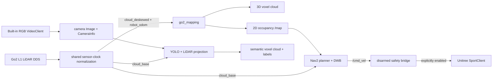

# Go2 EDU 3D SLAM, route navigation, and semantic mapping

For the safe two-terminal startup and arming sequence, see
[HOW_TO_RUN.md](HOW_TO_RUN.md).

This ROS 2 Foxy workspace is built for the Unitree Go2 EDU onboard Jetson and
its built-in L1 LiDAR and front RGB camera. It provides:

- bounded, persistent 3D voxel mapping from the firmware-deskewed L1 cloud;
- live 2D occupancy projection with ray clearing for Nav2;
- conservative goal and named-route navigation;
- saved-map AMCL localization for repeat routes;
- a real 3D semantic voxel cloud made by projecting camera detections onto the
  synchronized base-frame L1 cloud;
- explicit map/semantic export to PLY, PGM/YAML, NPZ, and JSON; and
- a disarmed-by-default Unitree Sport command bridge with timeouts, slew limits,
  odometry freshness checks, and a LiDAR front-sector stop.

The implementation is clean-room code informed by the requested
[Go2-Inspector](https://github.com/amberhandal/Go2-Inspector/tree/281cccaecf8aeffa5476cd7b70c34f8ad984f8f4)
and
[autonomy_stack_go2](https://github.com/jizhang-cmu/autonomy_stack_go2/tree/43d5f54b389b251713f0097893c30fa76c870d54)
references. Their camera/semantic assumptions and mixed ROS versions are not
copied; see [THIRD_PARTY.md](THIRD_PARTY.md).

## Architecture



Unitree's firmware L1 odometry pipeline produces `/utlidar/cloud_deskewed` in
`odom` at roughly 15 Hz and `/utlidar/robot_odom` at roughly 150 Hz. Its clock
is about 502 seconds behind the Jetson clock on this device. One bridge derives
a shared offset and republishes `/go2/lidar/cloud_deskewed`, `/go2/odom`, and
the base cloud in the Jetson ROS clock while preserving sensor-relative timing.
It also rotates the mounted native axes into REP-103 (X forward, Y left, Z up)
for clouds, pose, twist, and covariances. All project consumers use those
normalized topics. The mapper accumulates the
firmware-registered output without running a second heavy SLAM process on the
Jetson. Topics remain parameters, so a loop-closing backend can instead feed
verified registered-cloud and odometry inputs.

## Device baseline

The workspace targets the inspected device baseline:

- Ubuntu 20.04, ARM64, Jetson Orin NX 16 GB;
- ROS 2 Foxy with CycloneDDS;
- robot-facing interface `eth0` (`192.168.123.99/24` on this unit);
- live Go2 topics `/utlidar/cloud`, `/utlidar/cloud_base`,
  `/utlidar/cloud_deskewed`, and `/utlidar/robot_odom`; and
- Unitree SDK2 Python plus its no-shared-memory CycloneDDS build.

No additional USB camera, RealSense, or external LiDAR is assumed.

## Build

If this directory was created by root, correct it once:

```bash
sudo chown -R "$(id -un):$(id -gn)" /home/unitree/SLAM_nav
```

Then, as that same non-root login account:

```bash
cd /home/unitree/SLAM_nav
source scripts/env.sh
python3 scripts/doctor.py
./scripts/build.sh
source scripts/env.sh
```

`scripts/env.sh` selects Foxy, the robot's CycloneDDS overlay, `eth0`, and the
installed no-SHM Unitree SDK runtime. This ordering is required on this device;
the system `/usr/local` DDS library can crash Python SDK RPC writers.

### Optional project-local Conda environment for YOLO

The core ROS 2 nodes intentionally remain on Foxy's `/usr/bin/python3`. Create
and activate the Python 3.8 Conda environment for the semantic YOLO node with:

```bash
cd /home/unitree/SLAM_nav
./scripts/create_conda_env.sh
conda activate slam_nav
python3 scripts/doctor.py
```

Open a new terminal after the first creation so Bash loads Conda. For the
current terminal, run `source ~/.bashrc` before `conda activate slam_nav`.
The activation hook loads the ROS, CycloneDDS, Unitree SDK, and project overlay
automatically. `source scripts/activate_conda.sh` remains an equivalent helper.

This installs ARM64 Miniforge under `.miniforge3`, creates the environment at
`.conda/envs/slam_nav`, and mirrors the device's already validated Jetson CUDA
Torch/Ultralytics packages. It does not install a generic Torch build. Sourcing
`activate_conda.sh` also sources the ROS/device environment and sets
`GO2_SEMANTIC_PYTHON`. Once the environment exists, the regular `env.sh` and
mapping startup scripts also select it automatically for the semantic node.

Do not reuse maps, routes, or camera extrinsics produced against a raw
positive-Z-down `/utlidar` convention. This workspace's outputs and calibration
are explicitly REP-103 `/go2` data.

## Calibrate before semantic fusion

The camera stream is verified at 1920×1080, but this device contains no usable
factory camera intrinsics or camera-to-L1 extrinsics. Follow
[docs/CALIBRATION.md](docs/CALIBRATION.md), update the two package YAML files,
inspect the projected-point debug overlay, and only then mark the semantic
calibration confirmed. Unknown 3D geometry is available before calibration;
camera detections and colors are deliberately withheld until the calibration
gate passes. Until intrinsics are installed, the topic named
`/go2/camera/image_rect` is an unrectified passthrough used only to keep the
geometry-only pipeline observable.

## Map and navigate in one session

Start the complete stack:

```bash
./scripts/start_mapping.sh
```

This starts the camera bridge, mapper, semantic mapper, Nav2, and RViz. It does
not stand the robot and it does not enable motion. First verify:

```bash
ros2 topic hz /utlidar/cloud_deskewed
ros2 topic hz /utlidar/cloud_base
ros2 topic hz /utlidar/robot_odom
ros2 topic hz /go2/lidar/cloud_deskewed
ros2 topic hz /go2/lidar/cloud_base
ros2 topic hz /go2/odom
ros2 topic echo /go2/time_sync/status
ros2 topic echo /go2/mapping/status
```

The full-HD camera defaults to the device-validated 5 Hz operating point.
Override it with `camera_rate_hz:=N` (maximum 15 Hz) if a measured workload
requires another rate.

In RViz, check that the robot pose, 3D points, 2D map, and local costmap agree.
Read [docs/SAFETY.md](docs/SAFETY.md), clear the area, retain the physical
controller/E-stop, and explicitly arm the bridge:

```bash
./scripts/enable_motion.sh --i-understand
```

Use RViz **Nav2 Goal** / **2D Goal Pose** for a goal. Stop and disarm immediately:

```bash
./scripts/stop_motion.sh
```

## Named routes

Record the current pose into a route while the robot is stationary:

```bash
ros2 run go2_navigation go2_route \
  --file src/go2_navigation/config/routes.yaml \
  record inspection --name entrance --frame odom
```

Validate and run it:

```bash
ros2 run go2_navigation go2_route --file src/go2_navigation/config/routes.yaml validate
ros2 run go2_navigation go2_route --file src/go2_navigation/config/routes.yaml run inspection
```

An `odom` route is session-local. To repeat a route after reboot, save the map,
localize in it, and record/use `frame_id: map` routes.

## Save and reload

With the robot stopped:

```bash
./scripts/save_maps.sh
```

The geometric mapper writes a timestamped directory containing the 3D PLY,
2D PGM/YAML, reloadable NPZ state, and metadata. The semantic mapper writes a
semantic PLY plus JSON class-vote and calibration metadata.

For saved-map navigation after restart:

```bash
./scripts/start_localization.sh /absolute/path/to/map.yaml
```

Set the initial pose in RViz, wait for AMCL to converge, verify the scan/map
alignment while stationary, then arm motion explicitly. AMCL localizes in the
saved 2D projection; the NPZ/PLY files preserve the 3D map for viewing and
continued processing.

## Important interfaces

| Interface | Purpose |
|---|---|
| `/go2/camera/image_raw`, `/go2/camera/image_raw/compressed`, `/go2/camera/image_rect`, `/go2/camera/camera_info` | Built-in front camera bridge |
| `/go2/odom`, `/go2/lidar/cloud_base`, `/go2/lidar/cloud_deskewed` | Host-clock-normalized Go2 sensors |
| `/go2/time_sync/status` | Sensor clock offset and stream health |
| `/go2/map/cloud` | accumulated geometric 3D voxel map |
| `/map` | live 2D occupancy grid for Nav2 |
| `/go2/semantic/cloud` | labeled/colorized semantic 3D voxels |
| `/go2/semantic/markers` | class labels in RViz |
| `/cmd_vel` | Nav2 request; does not move a disarmed bridge |
| `/go2/motion/enable` | explicit `SetBool` software arm/disarm |
| `/go2/motion/stop` | immediate `Trigger` software stop/disarm |
| `/go2/map/save`, `/go2/map/reset` | geometric map lifecycle |
| `/go2/semantic/save`, `/go2/semantic/reset` | semantic map lifecycle |

## Limits

- The Go2 L1 is noisy and can miss low obstacles, cables, glass, and drop-offs.
- The camera and LiDAR are not hardware synchronized. Shared clock normalization,
  nearest-sample association, and age guards limit error, but motion still
  introduces projection error.
- The default firmware-LIO accumulator has no project-side pose-graph loop
  closure. Use saved-map AMCL for 2D repeat navigation or connect a verified
  loop-closing 3D backend through the configurable inputs.
- Semantic model availability does not imply calibration validity. Uncalibrated
  colored points are visually plausible but geometrically wrong.
- Software stops are not safety-rated and do not replace the physical E-stop.
- A sensor-clock, frame, pose-continuity, post-arm odometry, or LiDAR-health
  fault is latched. Stop and restart the complete stack; never restart only the
  sensor bridge into an existing map or active goal.

## Packages

- `go2_robot_bridge`: sensor-clock, onboard camera, and disarmed Sport adapters.
- `go2_mapping`: bounded 3D voxel mapping, occupancy ray casting, TF, save/load.
- `go2_navigation`: Nav2 live/localization bringup, cloud-to-scan, route CLI.
- `go2_semantic_mapping`: YOLO projection, semantic fusion, PLY/JSON export.
- `go2_bringup`: system launch composition.
